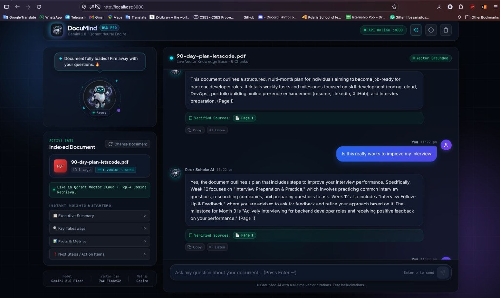
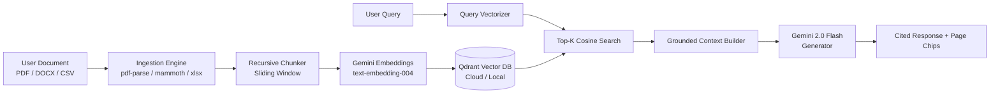

# DocuMind — Advanced Neural RAG Platform 🧠📄

> **Intelligent Document Intelligence powered by Google Gemini 2.0 & Qdrant Vector Engine**



---

## 🌟 Overview

**DocuMind** (Ask My PDF) is a production-grade Retrieval-Augmented Generation (RAG) platform designed to transform static documents into dynamic, conversational knowledge bases. Upload PDFs, DOCX files, spreadsheets, or CSVs and interact with your documents with zero hallucinations and verified source page citations.

---

## ✨ Key Features

- 🤖 **Dex AI Companion Mascot**: State-reactive animated companion indicating ingestion states (Standby, File Drag, Vector Indexing, Deep Retrieval, Answering).
- 🎨 **Obsidian Luxury Design System**: Deep dark mode aesthetics (`#05070c`), ambient glow, glassmorphism, and responsive dual-pane workspace.
- ⚡ **Multi-Format Ingestion Pipeline**: Ingest PDF, DOCX, XLSX, and CSV documents with sliding window chunking and metadata preservation.
- 🧠 **Semantic Vector Cloud**: Powered by **Google Gemini embeddings** (`text-embedding-004`, 768 dimensions) and **Qdrant Vector Database** with cosine similarity search.
- 🎯 **Strict Source Grounding**: Every answer is grounded directly in document chunks with clickable page citation chips (`📄 Page X`).
- ⚡ **Instant Insight Starters**: One-click prompt starters including *Executive Summary*, *Key Takeaways*, *Facts & Metrics*, and *Action Items*.
- 🔊 **Tactile Audio Feedback**: Synthesized Web Audio API sound effects for messages, indexing chimes, and query completions.
- 🗣️ **Text-to-Speech (TTS)**: Built-in voice synthesis to listen to answers.

---

## 🏗️ Architecture



---

## 🚀 Getting Started

### Prerequisites

- **Node.js** (v18 or higher)
- **Google Gemini API Key** ([Google AI Studio](https://aistudio.google.com/))
- **Qdrant Vector Database** ([Qdrant Cloud](https://cloud.qdrant.io/) or local Docker instance)

---

### 1. Backend Setup

```bash
cd backend
npm install

# Configure environment variables
cp .env.example .env
```

Edit `backend/.env` with your API credentials:
```env
PORT=4000
GEMINI_API_KEY=your_gemini_api_key_here
QDRANT_URL=your_qdrant_instance_url
QDRANT_API_KEY=your_qdrant_api_key
```

Run the backend server:
```bash
npm run dev
```
> Backend runs at `http://localhost:4000`

---

### 2. Frontend Setup

```bash
cd frontend
npm install

# Start Next.js development server
npm run dev
```
> Frontend runs at `http://localhost:3000`

---

## 📡 API Reference

### Document Ingestion
```http
POST /upload
Content-Type: multipart/form-data

file: <document_file>
```
**Response:**
```json
{
  "documentId": "uuid-v4",
  "filename": "90-day-plan-letscode.pdf",
  "chunkCount": 6,
  "pages": 1
}
```

### Grounded Question Answering
```http
POST /ask
Content-Type: application/json

{
  "documentId": "uuid-v4",
  "question": "What are the milestones for Month 3?"
}
```
**Response:**
```json
{
  "answer": "The milestone for Month 3 is actively interviewing...",
  "sources": [
    { "page": 1, "text": "..." }
  ]
}
```

---

## 🛠️ Tech Stack

- **Frontend**: Next.js 14, React 18, Tailwind CSS, Lucide Icons, Web Audio API
- **Backend**: Node.js, Express.js, Multer
- **Vector Database**: Qdrant Cloud (`cosine` metric, 768 Float32)
- **LLM & Embeddings**: Google Gemini 2.0 Flash & Gemini `text-embedding-004`
- **Parsers**: `pdf-parse`, `mammoth`, `xlsx`, `csv-parser`
